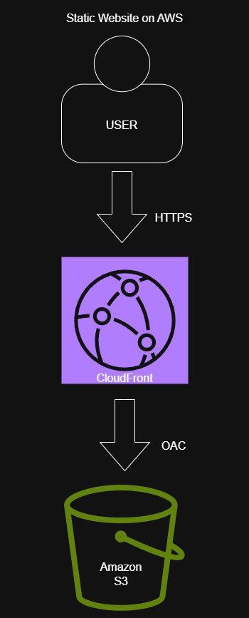
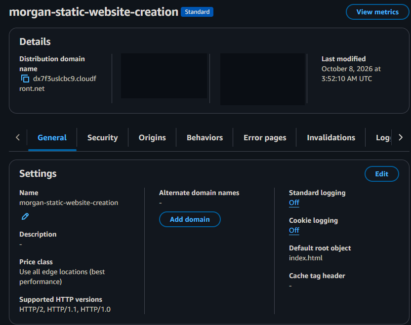
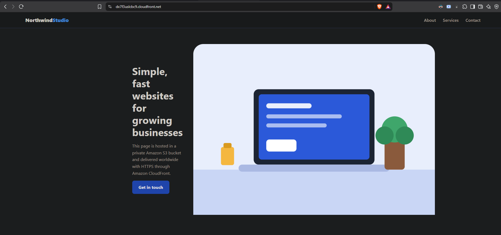
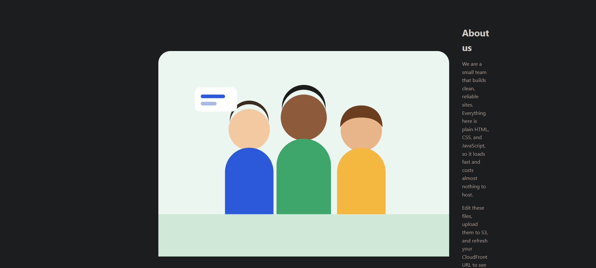
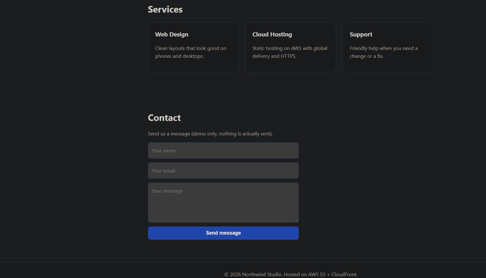

# Static Website on AWS with S3 + CloudFront 

A small static website hosted in a private Amazon S3 bucket and delivered over HTTPS through Amazon CloudFront. Built by hand in the AWS console as my second AWS project, following ProgramGuru's YouTube tutorial and adding my own page content and images.

## Architecture



```
User -> CloudFront (HTTPS) -> Origin Access Control (OAC) -> private S3 bucket
```

| Service | Role |
|---|---|
| Amazon S3 | Stores the site files (`index.html`, `styles.css`, `script.js`, `images/`) in a private bucket with Block all public access turned on |
| Amazon CloudFront | Serves the site over HTTPS from the default `cloudfront.net` address and caches it globally |
| Origin Access Control (OAC) | Lets only CloudFront read the bucket, through a bucket policy |

I skipped the custom domain step from the tutorial because a domain costs money, and the default CloudFront address already includes HTTPS.

## Screenshots

**Distribution settings**



**Live site**





## Repository contents

- `README.md`: this write-up
- `screenshots/`: architecture diagram and screenshots of the live site
- `site/`: the website files uploaded to S3

## Errors I hit and how I fixed them

### 1. XML `AccessDenied` when opening the CloudFront URL
- **Symptom:** The browser showed an XML error with `<Code>AccessDenied</Code>` instead of my page.
- **Cause:** I hadn't uploaded the files to the bucket yet. S3 returns `AccessDenied` instead of "not found" when a file doesn't exist and the caller can't list the bucket, so the error pointed away from the real problem. The bucket also needed the policy that CloudFront generates for OAC.
- **Fix:** Uploaded the files to the top level of the bucket (not inside a folder) and pasted CloudFront's **Copy policy** output into the bucket's **Permissions > Bucket policy**.
- **Lesson:** `AccessDenied` from a private bucket can simply mean the file isn't there. Check the bucket contents before debugging permissions.

### 2. The bare CloudFront address still failed, but `/index.html` worked
- **Symptom:** `https://<distribution>.cloudfront.net/index.html` loaded, but the root address returned the same error.
- **Cause:** No **default root object** was set, so CloudFront had no file to return for `/`.
- **Fix:** Set **Default root object** to `index.html` under the distribution's **General > Settings**, saved, and waited for the redeploy.
- **Lesson:** Testing a specific file path is a quick way to separate a permissions problem from a missing root object.

### 3. "Please enter a valid domain name" on the distribution setup page
- **Symptom:** The **Route 53 managed domain** field showed a red error.
- **Cause:** I had typed my bucket name into a field meant for a domain registered in my own Route 53 account.
- **Fix:** Cleared the optional field and continued without a custom domain.

### 4. Cramped layout and stale cached files
- **Symptom:** In the live site, the headline and About text were squeezed into narrow columns next to the images.
- **Cause:** My CSS let the images take too much width in the two-column sections.
- **Fix:** Updated `styles.css`, re-uploaded it to S3, and created a CloudFront **invalidation** for `/*` so CloudFront would stop serving the cached copy.
- **Lesson:** CloudFront caches files at its edge locations, so uploading a new file to S3 isn't enough. Invalidate the path (or wait for the cache to expire) to see changes.

## What I learned

- How CloudFront and S3 work together, and why a private bucket with OAC is safer than a public bucket
- What a bucket policy does and how CloudFront generates one
- How the default root object works
- How to debug by testing one change at a time instead of guessing
- How CloudFront caching and invalidations affect updates

## Cleanup

When finished, I disable the CloudFront distribution, wait for it to finish deploying, and delete it. Then I empty and delete the S3 bucket so nothing keeps running.

## Next steps

- Add a custom domain with Route 53 and an AWS Certificate Manager certificate
- Rebuild the same setup with Terraform
- Add a deploy script or GitHub Actions workflow to upload changes and invalidate the cache automatically
